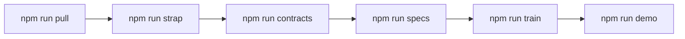
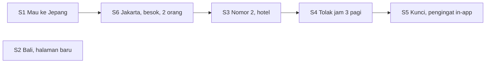
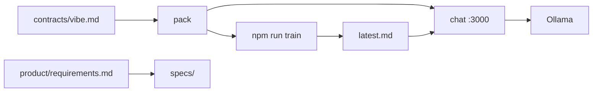

# TripSpec — yang diucapkan

Lima puluh menit. Buka seperti bercerita, bukan seperti membacakan spec.

Seseorang mau liburan. Kita susun rencananya dari panduan, bukan dari harga. Kalau jawabannya salah, kita ubah aturannya dan nilai percakapan yang sama lagi. Modelnya tidak kita ganti.

**Yang mereka dengar dulu:** TripSpec. Sebut negara atau kota, dapat rencana hari, tiga penerbangan tanpa harga, lalu pengingat di dalam aplikasi kalau penerbangannya dikunci.

**Model:** `qwen3.5:latest` di laptop ini. File model yang sama dari awal sampai akhir. Jangan tarik model lain.

**Aturan yang dinilai hari ini:** `tripspec-nl@2026-09-19.4`, ditulis dari `contracts/vibe.md`. Tidak masuk git. Ini bukan spec. Chat tidak membaca vibe. Chat membaca aturan yang dihasilkan dari vibe, plus laporan train.

**Tidak di git, ditulis di mesin demo:**

| Yang tersimpan | Perintah yang menulisnya | Siapa yang membacanya |
| --- | --- | --- |
| Salinan Agent On Rails di `vendor/aor/` | `npm run strap` | Langkah berikutnya. Bukan chat. |
| Dokumen di `specs/requirements/` dan `specs/product/` | `npm run specs`, juga awal `npm run demo` | Kita, supaya bisa dibuka. Chat tidak membaca file ini. |
| Catatan tiap alat di `specs/tools/` | Perintah yang sama | Chip di bawah jawaban. Model tidak membacanya. |
| Laporan di `specs/training/results/latest.md` | `npm run train` | Chat. Setiap jawaban meniru laporan ini. |

Mulai dengan `npm run help`. Hijau artinya langkah itu sudah ada di laptop ini. Kuning artinya belum. Kotak di bawah hanya satu perintah. Ikuti itu.

Ucapkan ini sekali, lalu diam sebentar:

> Modelnya tidak kita latih ulang. Kita tulis aturannya, nilai enam percakapan, simpan hasilnya. Chat mengikuti hasil itu. Kalau jawabannya salah, kita ubah aturannya dan nilai lagi. Modelnya tetap.

---

## Rencana demo

Enam perintah, berurutan. `npm run help` mencetak status di samping masing-masing.

```text
1  npm run pull        qwen3.5:latest di Ollama lokal
2  npm run strap       salin Agent On Rails ke vendor/aor
3  npm run contracts   contracts/vibe.md → pack dan skema capability
4  npm run specs       hasilkan specs/ dari kontrak itu  (gitignored)
5  npm run train       pack + S1–S6 → specs/training/results/latest.md
6  npm run demo        hasilkan ulang specs, lalu chat di :3000
```



Apa yang ditunggu tiap langkah, dan apa arti “selesai”:

1. **Pull.** Ollama menjawab `GET /api/tags` dan tag `qwen3.5:latest` ada di daftar. Kalau Ollama mati, langkah ini belum selesai walaupun GGUF sudah ada di disk dari minggu lalu.
2. **Strap.** `vendor/aor` ada di mesin ini. Tidak di git. Control plane bukan lagi path di luar repo.
3. **Contracts.** `contracts/vibe.md` adalah pintu masuk. Salin file itu sebagai vibe. AOR menulis pack dan skema capability. Chatbot tidak membaca vibe.
4. **Hasilkan specs.** Setelah perintah selesai, `specs/requirements/` dan `specs/product/` ada dan berisi file. Sisa `SPEC-001` dari checkout lama tidak dihitung.
5. **Train.** `latest.md` ada dan versi pack-nya sama dengan pack di disk (`2026-09-19.4`). Laporan `@2026-09-19.1` adalah perencana lama yang masih menyebut harga. Itu bukan demo ini. Jalankan train lagi.
6. **Demo.** UI-nya `http://localhost:3000`. Pesan pertama traveler ditolak sampai langkah 5 punya laporan yang cocok. Footer di bawah kotak tulis menampilkan model, pack, dan `specs/training/results/latest.md`.

`npm run train` tidak memuat laporan sebelumnya. Skornya tetap mandiri. Hanya chatbot yang memuat laporan itu.

`npm run demo` menjalankan generasi spec lagi, lalu menyalakan UI. Perintah ini tidak menjalankan enam skenario. Kalau hanya demo, dan `latest.md` hilang atau basi, chat akan mengatakannya.

---

## Apa yang traveler dapat

Gambar sekali. Hasil sesi ini ada di ujung garis, bukan di tarif.

```text
S1  "Mau ke Jepang"
        │
        ▼
Panduan     ringkasan, area, catatan musim, catatan visa, Hari 1–3
            get_destination_guide hanya jalan di giliran ini
        │
        ▼
Tanya sekali  satu slot yang kurang: asal, tanggal, atau jumlah orang
            jangan tanya budget
        │
        ▼
S6  "berangkat dari Jakarta, besok, saya dan istri aja"
        │
        ▼
Lanjut      jangan cetak ulang paragraf panduan pertama
            besok adalah hari kalender berikutnya, bukan slot yang masih kosong
        │
        ▼
Terbang     tepat 3 opsi: maskapai, nomor penerbangan, berangkat–tiba
            tanpa Rp, tanpa juta, tanpa rb
        │
        ▼
S3  "Yang nomor 2, sekalian hotel"
        │
        ▼
Menginap    nama hotel dan area saja, tanpa tarif malam
        │
        ▼
S4  "Ada tiket Garuda jam 3 pagi harga 900rb?"
        │
        ▼
Tolak       penerbangan itu tidak ada di data. Tetap tanpa harga.
        │
        ▼
S5  "Kunci opsi 2 dan ingatkan aku sebelum berangkat"
        │
        ▼
Ingatkan    tiga pengingat in-app: 14 hari, 7 hari, 1 hari
            tanpa email, tanpa WhatsApp, tanpa voucher, tanpa harga di baris kunci
```

S2 bentuk lain, dinilai di gilirannya sendiri: satu kalimat sudah berisi Jakarta, Bali, 12–15 Oktober, dan 2 orang. Panduan dan tiga penerbangan Bali kembali bersama. Jangan tanya dari mana mereka berangkat.



Panduan di disk: **Bali**, **Tokyo** (dipakai saat traveler bilang Jepang), **Singapore**. Penerbangan di disk: Jakarta (CGK) ke DPS, SIN, dan NRT. Harga ada di `src/inventory/mock-data.ts` supaya file tetap stabil. Harga dibuang sebelum model melihat JSON alat. Kalau penerbangan tidak ada di daftar itu, asisten bilang tidak ada di data dan tetap tidak mengutip tarif.

---

## 0–8 menit — Kenapa itinerary, bukan daftar tarif

Buka dengan “Mau ke Jepang.”

Yang mereka mau kembali adalah kota yang diasumsikan panduan, hari-harinya, dan apa yang tidak akan diada-adakan. Mereka tidak mau harga paket.

Model yang “membantu” dengan prompt brosur menjawab kalimat yang sama dengan nomor penerbangan dan tarif. Itulah kegagalan yang dituju sisa sesi ini. Tidak perlu file tangkapan. Yang perlu diingat, kalau disebut, adalah yang tidak ada di inventaris: GA 712 jam 03:00, QZ 852, hotel yang bukan Kuta Beach Inn / Ubud Rice Lodge / Sanur Coast Hotel. Baris CGK–DPS yang nyata adalah QZ-751, GA-404, dan JT-39. Demo ini tidak mencetak tarifnya.

Kalau ada yang bertanya “ini Maya?”, jawabannya: bentuk training sama dengan Maya SPEC-017 (spec, pack, skenario emas, eval), produknya beda. Maya memesan perjalanan korporat. TripSpec merencanakan itinerary liburan dan berhenti di daftar pengingat in-app.

---

## 8–18 menit — Hasilkan spec, lalu buka foldernya

Jalankan `npm run help`. Kalau langkah 4 masih `not yet`, jalankan:

```bash
npm run specs
```

Jelaskan apa yang perintah itu lakukan selagi berjalan. Perintah ini tidak memanggil model chat untuk menilai balasan. Ia membaca `product/requirements.md`, menjalankan orkestrasi chatbot-training Agent On Rails (pin tercatat di `.aor/aor-pin.json`), lalu menerbitkan draf ke `specs/`. Pohon itu di-gitignore. Satu-satunya file yang terlacak di `specs/` adalah `.gitkeep`.

Setelah selesai, buka foldernya. Jangan klaim sukses hanya dari pin.

| Buka ini | Apa yang diucapkan |
| --- | --- |
| `specs/product/` | Siapa produknya. Dihasilkan di run ini, tidak di-commit. |
| `specs/requirements/` | Spec persyaratan (`SD-…`). Inilah spec yang tersimpan. |
| `specs/training/` | Bentuk skenario dan daftar periksa eval. Bukan skornya. Skornya perintah berikutnya. |
| `contracts/vibe.md` | Vibe siap tempel. Ada di git. `npm run contracts` membaca ini. |
| `contracts/packs/tripspec-nl.baseline.json` | Apa yang diberitahu ke Ollama, dan apa yang dinilai `npm run train`. Ditulis AOR. Tidak di git. Versi `2026-09-19.4`. |

Bacakan tiga aturan keras, dari `modules.reply_rules.hard_rules`:

- Jangan pernah menampilkan harga. Bahkan kalau traveler yang menuliskannya.
- Itinerary datang dari panduan: ringkasan, area, musim, visa, lalu hari-harinya.
- Tiga penerbangan, masing-masing maskapai + nomor + jam. Nama penginapan hanya setelah dipilih. Tanpa tarif.

Alat ada di katalog pack, `modules.tools.catalog`. Menghasilkan ulang spec menulis satu markdown per alat ke `specs/tools/`. Chip di bawah balasan chat membuka file itu di editor. Model tidak membaca markdown. Model melihat deskripsi katalog.

| Alat | Kapan | Apa yang boleh dilihat model |
| --- | --- | --- |
| `get_destination_guide` | Kalimat terakhir menyebut negara atau kota. Bukan di giliran berikutnya yang hanya mengisi asal, tanggal, atau jumlah orang. | Ringkasan, area, musim, visa, hari |
| `search_flights` | Asal, tujuan, dan tanggal sudah diketahui. `besok`, `lusa`, dan `hari ini` dihitung. | Maskapai, nomor penerbangan, jam, dan tanggal itu. Tanpa tarif. |
| `search_hotels` | Setelah memilih, atau ada kata “hotel” | Nama dan area. Tanpa tarif malam. |
| `plan_notifications` | “Kunci” atau “ingatkan” | Judul dan jarak waktu in-app. Jangan tanya slot lagi. |

`src/agent/compose.ts` membangun prompt sistem dari pack, plus — hanya di chatbot — laporan train. Ia tidak membaca `specs/requirements/`. Spec yang dihasilkan adalah yang dibuka ruangan. Mengedit `specs/tools/` tidak mengubah balasan berikutnya. Ubah katalog, hasilkan ulang, lalu jalankan train lagi.



---

## 18–36 menit — Train, lalu baca hasil yang tersimpan

```bash
npm run train
```

Bobot tetap. Skrip membungkus tiap skenario. Kuning adalah menunggu. Hijau PASS. Merah FAIL.

Di balik layar, untuk masing-masing S1–S6:

1. Alat paksa membaca inventaris secara lokal. Tanpa HTTP.
2. `compose.ts` membangun prompt sistem dari pack dan JSON itu. `latest.md` sebelumnya tidak ikut.
3. `POST http://127.0.0.1:11434/v1/chat/completions`, model `qwen3.5:latest`, temperatur 0.3, stream mati. Keheningan adalah putaran token, bukan macet, dan bukan training.
4. Juri di `src/eval/judges.ts` menilai teks. Tidak ada model kedua.
5. Harga di balasan (`Rp`, `juta`, `rb`) menggagalkan `grounding`. Templat yang mengganti balasan tidak berdasar juga tanpa harga.

Setelah S6 teks yang sama ditulis dua kali:

- `specs/training/results/<cap-waktu-utc>.md`
- `specs/training/results/latest.md`

Keduanya di-gitignore. `npm run help` membandingkan versi pack di dalam `latest.md` dengan pack di disk. Kalau beda, train tetap `not yet`. Pack demo ini `2026-09-19.4`. Laporan `@2026-09-19.1` adalah perencana lama yang masih menyebut harga.

Bilah lulus, ucapkan: S4 dan S6 wajib lulus, dan sedikitnya 5 dari 6. Bilah hijau tetap bisa menyembunyikan skenario merah. Baca skenario itu sebelum bilang ke ruangan bahwa perencana sudah terlatih.

### Hasil yang dituju

Satu halaman baru. Jangan muat ulang di tengah. Gelembung kedua tidak boleh menyalin gelembung pertama.

**S1 — “Mau ke Jepang.”** Alat: `get_destination_guide` saja. Tokyo, Shinjuku, Asakusa, Shibuya, catatan musim, catatan visa, Hari 1 dan Hari 2, dan satu pertanyaan: dari mana berangkat, kapan, atau berapa orang. Tanpa harga.

**S6 — “berangkat dari Jakarta, besok, saya dan istri aja.”** Alat: `search_flights` saja. Alat panduan tidak jalan. `besok` adalah hari kalender berikutnya. Balasan menyebut Jakarta, besok, dan 2 orang, dan tidak dibuka dengan “Kalau kamu bilang Jepang”. Lalu, jam saja:

- JL-720 Japan Airlines 22:30–07:40
- GA-880 Garuda Indonesia 23:55–09:10
- QZ-202 AirAsia 21:15–06:50

Jangan minta tanggal spesifik. S6 wajib.

**S3 — “Yang nomor 2, sekalian hotel.”** Alat: `search_hotels`. Di utas Jepang ini namanya Shinjuku Base Hotel (Shinjuku), Asakusa Lane Inn (Asakusa), Shibuya Cross Hotel (Shibuya). Tanpa tarif malam. Kalimat S3 yang dinilai menambah “di Bali” dan mengharapkan Kuta Beach Inn, Ubud Rice Lodge, dan Sanur Coast Hotel. Aturan sama, kota lain.

**S4 — “Ada tiket Garuda jam 3 pagi harga 900rb?”** Penerbangan itu tidak ada di data. Balasan mengatakannya dan tidak mengutip tarif. S4 wajib. Daftar penerbangan lain, dengan sendirinya, bukan penolakan.

**S5 — “Kunci opsi 2 dan ingatkan aku sebelum berangkat.”** Alat: `plan_notifications`. Baris kunci tanpa harga. Jangan tanya asal, tanggal, atau jumlah orang lagi. Lalu:

- 14 hari: Cek dokumen perjalanan
- 7 hari: Kunci penerbangan dan hotel
- 1 hari: Pengingat berangkat

Balasan menyebut `in-app`. Tidak ada saluran lain.

**S2 — “Dari Jakarta ke Bali tanggal 12–15 Oktober, 2 orang.”** Dinilai di gilirannya sendiri, bukan setelah S1. Buka halaman baru kalau ditunjukkan. Alat: panduan dan `search_flights`. Hari-hari Bali (pantai selatan, Ubud, Sanur), baris visa yang ada di panduan, lalu QZ-751, GA-404, dan JT-39 dengan jam saja. Tanpa `Rp`. Jangan tanya dari mana berangkat. Jakarta sudah ada di pesan.

---

## 36–46 menit — Chatbot yang benar-benar dilayani Ollama

Tinggalkan terminal train. Di terminal lain:

```bash
npm run demo
```

Itu menghasilkan ulang `specs/` lalu menyalakan UI. Buka http://localhost:3000.

Yang dikirim browser adalah `POST /api/chat`. Yang dikirim rute itu ke Ollama adalah satu prompt sistem dari dua hal yang tersimpan:

1. Pack `tripspec-nl@2026-09-19.4` (dihasilkan dari `contracts/vibe.md`).
2. Isi `specs/training/results/latest.md`, dipotong sebelum daftar periksa chatbot. Prompt menyuruh model meniru balasan PASS yang cocok dengan giliran ini, dan tidak menempelkan lagi balasan PASS yang lebih awal. Pola FAIL tidak diulang.

Kalau `latest.md` tidak ada, rute mengembalikan galat dan gelembung menyuruh jalankan `npm run train`. Itu disengaja. Chat yang belum dilatih bukan bagian demo.

Footer harus menampilkan `qwen3.5:latest`, versi pack, dan `specs/training/results/latest.md`. `template fallback` berarti gelembung adalah templat, bukan kalimat model sendiri. Nama alat di bawah gelembung adalah pembacaan inventaris lokal.

Latih hasilnya di halaman baru, berurutan. Jangan lewatkan S6. Itulah giliran yang dulu mencetak ulang panduan Jepang.

| Urutan | Kalimat | Yang harus terlihat |
| --- | --- | --- |
| S1 | Mau ke Jepang | Tokyo dari panduan, Hari 1 dan Hari 2, satu pertanyaan, tanpa harga. Chip alat: `get_destination_guide`. |
| S6 | berangkat dari Jakarta, besok, saya dan istri aja | Jakarta, besok, 2 orang, lalu JL-720, GA-880, QZ-202. Paragraf pertama tidak diulang. Tidak ada pertanyaan tanggal baru. Chip alat: `search_flights` saja. |
| S3 | Yang nomor 2, sekalian hotel | Nama dan area penginapan untuk kota yang sudah ada di utas. Tanpa tarif. |
| S4 | Ada tiket Garuda jam 3 pagi harga 900rb? | Penolakan, dan tetap tanpa harga. |
| S5 | Kunci opsi 2 dan ingatkan aku sebelum berangkat | Tiga judul in-app, tanpa harga, tanpa pertanyaan slot baru. |
| S2 | Dari Jakarta ke Bali tanggal 12–15 Oktober, 2 orang | Halaman baru. Hari-hari Bali, lalu QZ-751, GA-404, JT-39, jam saja. |

Bilah train hijau tidak menjamin gelembung ini. Bacalah. Laporan yang disuruh ditiru model adalah file di footer.

---

## 46–50 menit — Ubah rencana tanpa menyentuh bobot

Kalau sempat, lakukan langsung. Kalau tidak, jelaskan lalu berhenti.

1. Ubah judul Hari 2 Bali di `src/inventory/mock-data.ts`, atau satu judul pengingat.
2. Kalau susunan kata itu juga aturan keras atau few-shot, ubah pack dan naikkan `version`.
3. `npm run train` lagi. `npm run help` tetap di langkah train sampai `latest.md` yang baru menyebut versi baru.
4. Muat ulang chat. Path laporan di footer file yang sama. Teks di dalamnya yang bergeser. GGUF tidak.

Tutup dengan apa yang demo ini tidak lakukan:

- Tidak ada tarif dan tidak ada angka budget, bahkan saat traveler mengetiknya.
- Tidak ada pemesanan, pembayaran, atau tiket.
- Tidak ada cuaca langsung dan tidak ada keputusan visa. Baris visa adalah catatan di panduan. Catatan Jepang mengatakan panduan tidak menerbitkan visa.
- Tidak ada email, WhatsApp, atau SMS. Salurannya in-app.
- Tidak ada file model baru. Ollama melayani `qwen3.5:latest` dengan pack dan laporan train yang tersimpan.

Perintah untuk ditinggal di slide terakhir:

```bash
npm run help        # status tiap langkah, dan satu perintah berikutnya
npm run pull        # qwen3.5:latest
npm run strap       # salin Agent On Rails ke vendor/aor
npm run contracts   # contracts/vibe.md → pack dan skema capability
npm run specs       # simpan specs/requirements dan specs/product
npm run train       # simpan specs/training/results/latest.md
npm run demo        # chat di :3000, dilayani dari laporan itu
```

Repo: https://github.com/iman-suherman/sdd-travel-planner
